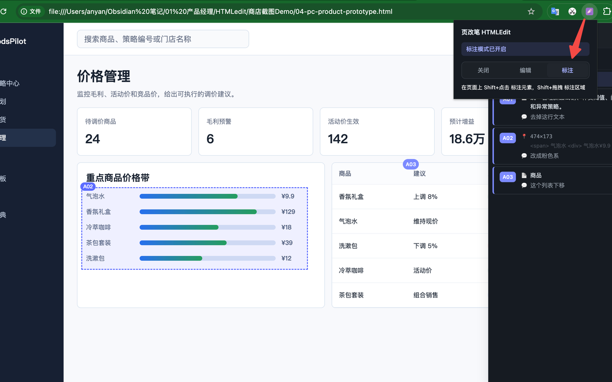
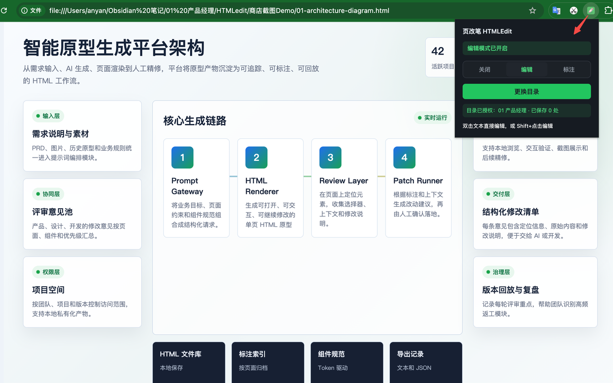
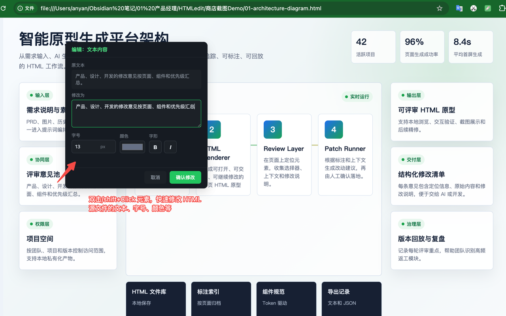
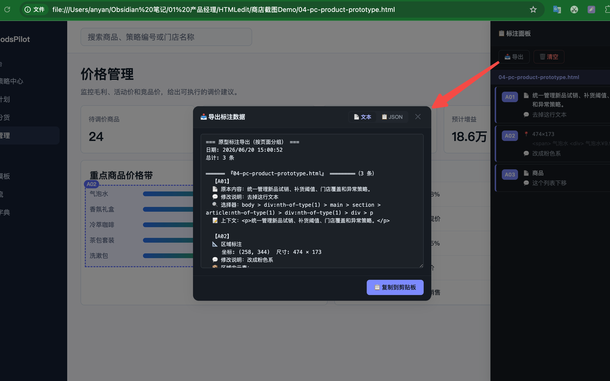

# 页改笔 HTMLEdit

> AI 生成 HTML 之后的精修工具。本地 HTML 可直接编辑文字和轻量样式，标注模式把方案调整结构化交给 AI 或开发。
>
> Chrome MV3 扩展 · 纯原生 JavaScript · 零依赖

[](#安装) [](#license) [](#技术架构)


> 标注模式：Shift+Click 标注元素，自动生成定位信息，导出结构化文本给 AI


> 编辑模式：双击文本元素即可修改，支持字号颜色等轻量样式调整


> 编辑操作：修改确认后通过 File System Access API 原地保存到本地文件


> 导出标注：按页面分组打包，文本 / JSON 双格式，一键复制交付给 AI 或开发

---

## 为什么做这个

PPT、架构图、产品原型、活动海报——越来越多东西开始用 AI 直接生成 HTML。HTML 格式相比 PPT、Axure 这些传统格式，表现力强、交互效果逼真、还能直接跑动画和逻辑，做初稿的优势很明显。

但 HTML 也有它的短板，而且这个短板在"精修"阶段特别扎手：**改个文案很麻烦**。

PPT 里双击文本框就能改字，Axure 里也是。但 HTML 是代码，要改一句"暂存"成"待审核"，你得找到对应的 `<span>`、改 `textContent`、存盘、刷新。把整段 HTML 复制给 AI 让它改一句文案？大材小用，还容易把别的地方动坏。

页改笔的编辑模式就是补这个短板的。对本地 HTML，双击文本元素就能修改文字和轻量样式，并写回用户授权目录里的源文件，跟在 PPT 里改文本框一样直接。

那交互样式、设计方案要调呢？比如"这个状态标签颜色不对""这块布局重做""这里加个数据看板"——这类改动不适合手动改，还是得交给 AI。问题是你要怎么把"这里"精确地告诉 AI？口头描述太模糊，截图标注丢上下文，手写 prompt 容易漏掉定位信息。

页改笔的标注模式就是解决这个的。在页面上精准标注要改的地方，自动抓取 CSS 选择器和 HTML 上下文，一键导出结构化文本或 JSON，交给 AI、Issue、PRD 或开发文档。

两个模式，两类问题：**编辑模式管文字和轻量样式，标注模式管方案**。

```
AI 生成初稿
  ├─ 文案和轻量样式要改？→ 编辑模式，双击/Shift+Click，授权目录内原地保存
  └─ 方案要调？→ 标注模式，精准标注 + 导出，交给 AI 或开发
```

---

## 核心功能

### 编辑模式：补上 HTML 缺失的"直接修改"能力

HTML 格式表现力强，但没有 PPT/Axure 那种双击即改的文本编辑入口。编辑模式让本地 HTML 也能像设计稿一样直接修改文字和轻量样式。

- **直接编辑**：双击文本元素（或 Shift+Click）弹出编辑卡片，改完确认即生效
- **轻量样式**：支持字号、颜色、加粗、倾斜等常见文字样式调整
- **原地保存**：通过 File System Access API 覆盖授权目录内的本地 HTML 文件，不弹下载框、不生成副本
- **一次授权**：首次使用授权一次原型目录，后续编辑静默保存
- **可撤销**：保存成功后可撤销上一次修改，保存失败会回滚页面 DOM
- **编辑标记**：被编辑过的元素显示绿色虚线边框（`#22c55e`）+ 淡绿色背景，session 内可见，退出编辑模式后清除
- **支持的元素**：input、textarea、button、a、label、span、p、div、h1-h6、td、th、li 等常见文本元素

适合的场景：改文案、改占位符、改按钮文字、改标题、微调文字样式——任何不需要重构页面结构的修改。不用为了改一句文案就把整个 HTML 发给 AI。

> 注意：原地保存仅适用于用户授权目录内的本地 HTML 文件。在线网页可用于标注和临时页面检查，但无法写回远程网站源文件。

### 标注模式：把"这里要改"精准地交给 AI

交互样式、设计方案要调整时，手动改不现实，交给 AI 才合适。但 AI 需要精确的定位和明确的意图。

- **元素标注（Shift+Click）**：点击任意元素，弹出标注卡片，填「修改为」和「修改说明」
- **区域标注（Shift+拖拽）**：框选一片区域，填整体说明，适合"这里新增一个组件""这块整体重做"
- **自动定位信息**：每条标注自动生成 CSS 选择器路径 + 父级 HTML 上下文（前 600 字符），确保 AI 能精确找到代码行
- **徽章编号**：A01、A02... 标注编号徽章定位在元素右上角，滚动跟随，点击可重新编辑
- **状态流转**：标注可在待处理、完成、拒绝等状态间切换，便于跟踪评审进度
- **跨页面汇总**：多个 HTML 页面的标注在同一个面板里按页面分组展示

适合的场景：调样式、改交互、重做布局、新增组件——任何需要 AI 来动的结构性修改。

### 导出：标注模式的交付物

把标注按页面分组打包，交给 AI 或开发。

- **按页面分组**：导出文本按页面分组，每组带页头和条数
- **结构化字段**：每条标注包含编号、原文 📄、修改后 ✏️、修改说明 💬、状态、CSS 选择器、HTML 上下文；区域标注还包含坐标、尺寸和覆盖元素
- **两种格式**：文本（给人看）和 JSON（给程序处理），切换 tab 选择
- **一键复制**：复制到剪贴板，可手动粘贴到 AI 对话框、Issue、PRD 或开发沟通文档

导出文本示例：

```
=== 原型标注导出（按页面分组） ===
日期: 2026/6/19 14:00:00
总计: 2 条

══════ 『创建规则页』 ══════（2 条）

  【A01】
  📄 原本内容：暂存
  ✏️ 修改后：待审核
  💬 修改说明：状态标签颜色改为橙色，和待审核状态区分开
  状态：pending
  选择器：table tbody tr:nth-of-type(1) td:nth-of-type(7) .status-tag
  上下文：<span class="status-tag status-tag-pending">已提交</span>

  【A02】
  📐 区域标注
  💬 修改说明：这里新增一个数据看板组件，展示实时库存
  区域坐标：left:160, top:240, width:400, height:300
  覆盖元素：button、table、span.status-tag
=== 导出结束 ===
```

> 注：标注卡片也支持填写「修改为」字段附带文本替换建议，但文案的直接修改建议优先用编辑模式原地保存，标注模式主要用于方案和交互调整。

---

## 安装

### 方式一：Chrome Web Store（推荐）

> 上架后补充链接

### 方式二：从源码加载（开发者）

1. 克隆本仓库

   ```bash
   git clone https://github.com/<你的用户名>/<仓库名>.git
   ```

2. 打开 Chrome，访问 `chrome://extensions`
3. 右上角开启「开发者模式」
4. 点击「加载已解压的扩展程序」，选择仓库内的 `浏览器插件/prototype-annotator/` 目录
5. 扩展图标出现在工具栏，点击即可使用

### 使用本地 HTML 文件

如果要在本地 HTML 文件上使用（比如 AI 生成的原型、Obsidian vault 里的 HTML）：

1. 在 `chrome://extensions` 找到页改笔，点击「详细信息」
2. 开启「允许访问文件网址」（Allow access to file URLs）
3. 用 Chrome 直接打开本地 HTML 文件即可

---

## 使用流程

### 场景一：改文字和轻量样式——用编辑模式

1. 用 AI 生成产品原型的 HTML，保存到本地，用 Chrome 打开
2. 点击扩展图标，授权原型目录并切换到「编辑」模式
3. 双击或 Shift+Click 要改的文案，修改文字、字号、颜色等内容，确认
4. 写回授权目录内的 HTML 文件，刷新即可看到效果

不用为了改一句文案就把整个 HTML 复制给 AI。

### 场景二：调方案——用标注模式 + 导出给 AI 或开发

1. 切换到「标注」模式，右侧面板展开
2. 交互样式要调？Shift+Click 元素 → 填「修改说明」（如"状态标签颜色改为橙色"）
3. 整块要重做？Shift+拖拽框选区域 → 填说明
4. 点面板「导出」按钮，选文本格式，复制到剪贴板
5. 手动粘贴到 AI 对话框、Issue 或开发文档，让对方拿着精确的选择器和上下文做第二轮修改

### 场景三：原型评审交付

1. PM 在原型上标注所有修改意见
2. 导出结构化文本
3. 交付给开发，开发打开导出文件即可定位到对应元素

---

## 技术架构

### Chrome MV3 扩展，零依赖

```
manifest.json              # MV3 配置
background.js              # Service Worker — 消息路由 + 模式状态 + FSA 文件写入
popup.html / popup.js      # 三态模式切换弹窗（关闭/编辑/标注）
content/
  storage.js               # chrome.storage.local 封装
  selector.js              # CSS 选择器生成 + 元素查找
  messaging.js             # 消息收发 + 跨 frame 通信
  area-selector.js         # Shift+拖拽 区域标注
  annotator.js             # 标注核心：hover 高亮、Shift+Click 卡片、徽章
  editor.js                # 编辑模式：hover 高亮、双击/Shift+Click 编辑卡片
  panel.js                 # 侧边面板：列表、分组、导出、FAB
  content.js               # 顶层编排：模式激活/停用、消息分发
  content.css              # 注入样式
icons/                     # 4 种状态的图标（default/inactive/active/edit）
```

### 关键技术点

**File System Access API 原地保存**

编辑模式最大的技术挑战是在 `file://` 协议下可靠地覆盖原 HTML 文件。最终方案是在 background service worker 里通过 IndexedDB 持久化用户授权的目录句柄（`FileSystemDirectoryHandle`），首次授权后即可静默写入，不弹文件选择器。详见 `background.js` 的 `getWritableFileHandle` 和 `saveEditedHtml`。

**跨 frame 注入**

原型页面常通过 `<iframe>` 加载子页面，事件无法穿透 frame 边界。通过 `webNavigation.getAllFrames` 枚举所有 frame，再用 `chrome.tabs.sendMessage` 带 `frameId` 向每个 frame 发消息，实现 iframe 内页面的标注和编辑。

**Shadow DOM 隔离**

所有工具 UI（面板、卡片、徽章）用 Shadow DOM 隔离样式，避免被页面 CSS 污染，也避免工具样式影响页面。

**零依赖**

纯原生 JavaScript，没有 jQuery、React、Vue，没有任何构建步骤。所有逻辑是 IIFE 模块，按 manifest 里 `content_scripts.js` 数组的顺序加载。

### 权限

| 权限 | 用途 |
|------|------|
| `activeTab` | 用户选择模式时启用当前标签页功能 |
| `scripting` | 确保 content scripts 已注入并激活对应模式 |
| `storage` / `unlimitedStorage` | 本地保存标注数据 |
| `webNavigation` | 枚举 frame 以注入 iframe |
| `host_permissions` | 支持 `file://` 本地 HTML 和 `http(s)://` 页面中的标注/临时检查 |

扩展不会将用户数据上传到开发者服务器或第三方服务。用户主动复制导出内容并粘贴给 AI 或协作工具时，数据传输由用户自行发起。

---

## 适合谁

- 用 AI 生成 HTML 原型/海报/演示稿，想快速改文案和轻量样式又不想把整个 HTML 发给 AI 的人——用编辑模式
- 需要调整 AI 初稿的交互样式、设计方案，要精准标注后交给 AI 精修的人——用标注模式
- 产品经理、设计师做原型评审，需要把修改意见结构化交付给开发
- 开发者接收修改工单，希望打开导出文件就能定位到对应元素

---

## 开发

### 环境要求

- Chrome 102+（需要 File System Access API 和 MV3）
- 不需要 Node.js、不需要构建

### 本地开发

1. 克隆仓库
2. `chrome://extensions` → 开启开发者模式 → 加载 `浏览器插件/prototype-annotator/` 目录
3. 修改代码后，在扩展卡片上点「刷新」按钮即可重载

### 测试

仓库内 `test-fixtures/html-cases/` 包含各种测试用例：静态文章、表单控件、动态运行时、样式继承、iframe 嵌套等，用于验证标注和编辑在各种页面结构下的行为。

```bash
# 语法检查
node --check content/annotator.js
node --check content/editor.js
node --check background.js
```

### 目录结构

```
.
├── .gitignore
├── LICENSE
├── README.md
├── 商店截图/
│   ├── 01-标注模式.jpg
│   ├── 02-编辑模式.jpg
│   ├── 03-编辑操作.jpg
│   └── 04-导出标注.jpg
└── 浏览器插件/
    └── prototype-annotator/      # 扩展源码（加载到 Chrome 的目录）
        ├── manifest.json
        ├── background.js
        ├── popup.html / popup.js / popup.css
        ├── content/              # 8 个功能模块
        └── icons/                # 4 种状态图标
```

---

## Roadmap

### 已完成（v2.0.3）

- 元素标注（Shift+Click）
- 区域标注（Shift+拖拽）
- 文本/轻量样式编辑 + 原地保存（File System Access API）
- 上一次编辑撤销
- 标注状态流转
- 跨页面汇总 + 按页面分组导出
- 文本 / JSON 双格式导出
- 深色主题
- iframe 内标注与编辑

---

## 已知限制

- **区域标注无法像元素标注一样重定位 DOM**：区域标注可编辑说明，但没有唯一 DOM 选择器，页面结构变化后可能需要重新框选
- **徽章在动态渲染页面可能不准**：基于选择器查找，页面 DOM 变化后可能失效，刷新页面重新加载
- **编辑模式需要授权目录**：首次使用需授权原型目录，且页面必须在授权目录内
- **在线网页不能写回源文件**：在线页面可用于标注和临时检查，编辑模式无法保存到远程网站源文件
- **iframe 内编辑**：iframe 内的页面编辑会保存到 iframe 对应的 HTML 文件，需确保该文件在授权目录内

---

## 贡献

欢迎提 Issue 和 PR。

- Bug 报告：请附上复现步骤、页面结构（是否含 iframe）、Chrome 版本
- 功能建议：请说明使用场景和期望的工作流
- PR：请先开 Issue 讨论设计，再提交代码

---

## License

MIT
